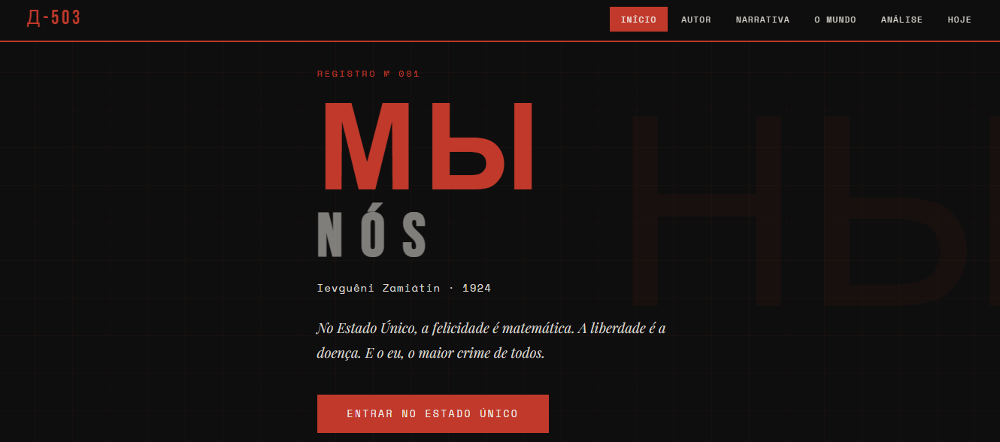

# Outro Mundo Possível

<p align="center">
  
</p>

<p align="center">
  
  
  
</p>

**Outro Mundo Possível** é uma aplicação web desenvolvida como parte de um trabalho escolar com o objetivo de apresentar, de forma interativa, reflexões sobre a construção de sociedades mais justas, sustentáveis e inclusivas. O projeto combina conteúdo informativo com uma interface moderna para incentivar a exploração do tema pelos usuários.

## Objetivo

O projeto foi desenvolvido para estimular a reflexão sobre diferentes possibilidades de organização social, abordando temas relacionados à cidadania, sustentabilidade, igualdade, educação e participação coletiva.

## Funcionalidades

- Navegação intuitiva entre os conteúdos
- Interface responsiva
- Organização do conteúdo em seções
- Layout moderno e minimalista
- Aplicação desenvolvida como página única (SPA)

## Tecnologias

- React
- Vite
- JavaScript (ES6+)
- HTML5
- CSS3

## Pré-requisitos

- Node.js 18 ou superior
- npm

## Instalação

Clone o repositório:

```bash
git clone https://github.com/Marcus-Jr/outro-mundo-possivel.git
cd outro-mundo-possivel
```

Instale as dependências:

```bash
npm install
```

Execute o servidor de desenvolvimento:

```bash
npm run dev
```

Para gerar a versão de produção:

```bash
npm run build
```

Visualize a versão de produção localmente:

```bash
npm run preview
```

## Estrutura do projeto

```text
outro-mundo-possivel/
├── public/
├── src/
│   ├── components/
│   ├── assets/
│   ├── App.jsx
│   ├── main.jsx
│   └── ...
├── package.json
└── vite.config.js
```

## Arquitetura

```text
Usuário
    │
    ▼
Interface React
    │
    ▼
Componentes
    │
    ▼
Conteúdo Educacional
```

## Desenvolvimento

A aplicação foi construída utilizando **React** e **Vite**, priorizando simplicidade, organização dos componentes e uma experiência de navegação fluida. O foco principal do projeto foi a apresentação do conteúdo de maneira clara e acessível, atendendo aos objetivos do trabalho acadêmico.

## Testes

O projeto não possui testes automatizados.

A validação pode ser realizada verificando:

- carregamento da aplicação;
- navegação entre as seções;
- responsividade da interface;
- funcionamento dos elementos interativos.

## Autor

**Marcus Everton De França Junior**

GitHub: https://github.com/Marcus-Jr
